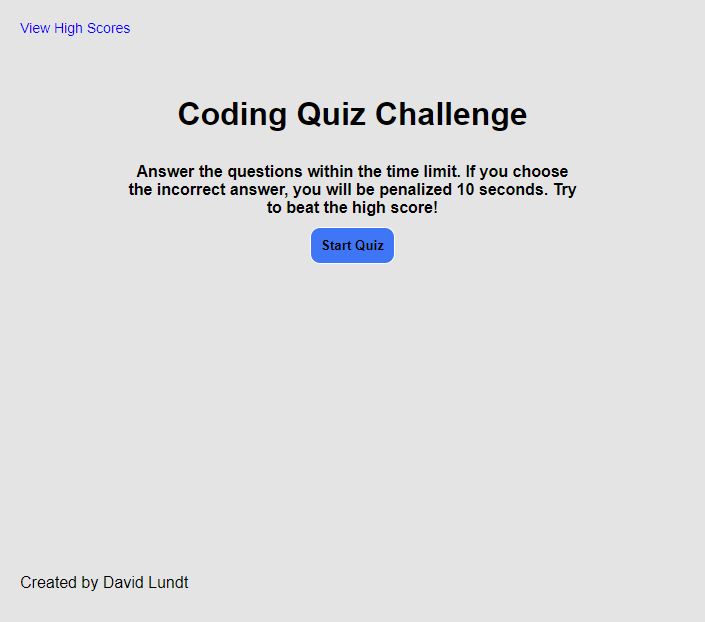

# JavaScript Coding Quiz

## About This Project

This is a quiz program written in JavaScript with boilerplate questions about JavaScript that can be easily modified for any topic. Once you click the "Start Quiz" button, you will be presented with a series of questions and a timer. If you choose an incorrect answer, you will be deducted 10 seconds. If you run out of time or finish all the questions, you are presented with an end game screen where your initials can be entered and displayed on a High Scores page. Entered initials and scores are saved to localStorage and retrieved for the list of high scores.

## Built With

* HTML
* CSS
* JavaScript

## Website URL

https://apatheticjedi.github.io/javascript-code-quiz/

##

Created by David Lundt
